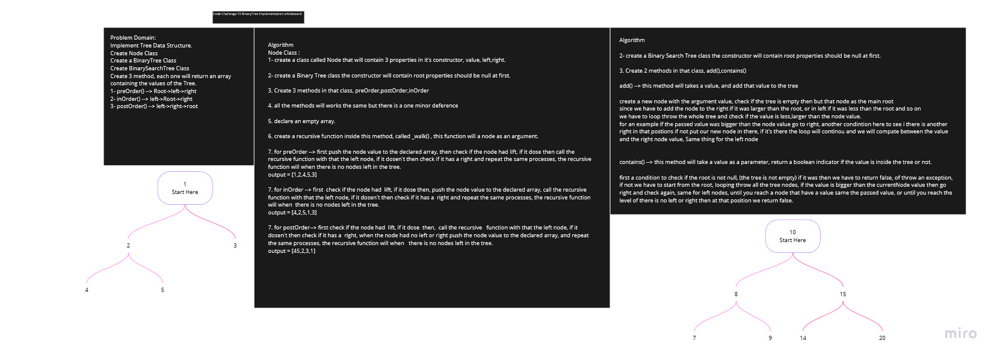
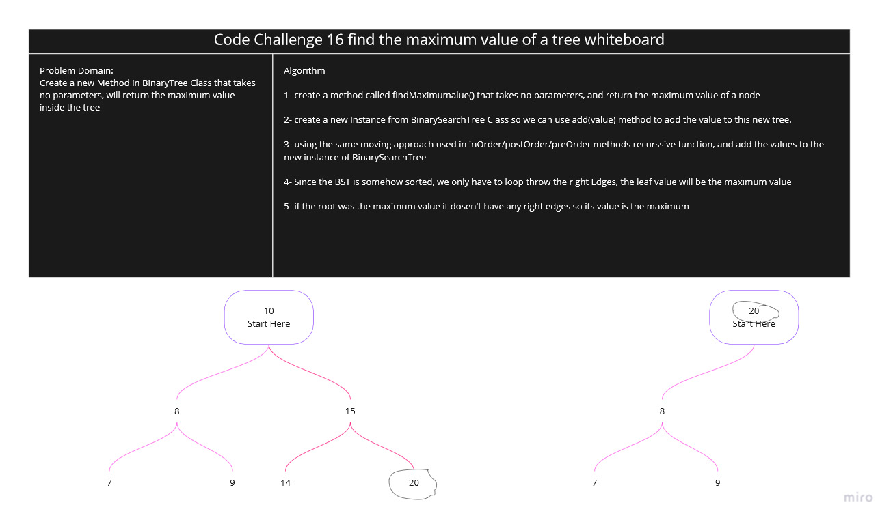

# Binary Tree and BST Implementation

<!-- Short summary or background information -->

## Challenges

<!-- Description of the challenge -->

- ## Code Challenge 15

Implement BinaryTree Data Structure.
Implement BinarySearchTree

Create Node Class

Create a BinaryTree Class

Create 3 method, each one will return an array containing the values of the Tree.

1. preOrder() --> return an array of the values follows this approach Root->left->right

2. inOrder() --> return an array of the values follows this approach left->Root->right

3. postOrder() --> return an array of the values follows this approach left->right->root

Create BinarySearchTree Class

1. create a Binary Search Tree class the constructor will contain root properties should be null at first.

2. Create 2 methods in that class, add(),contains()

## Approach & Efficiency

<!-- What approach did you take? Why? What is the Big O space/time for this approach? -->

for the BinaryTrees, all the methods works tha same called an recessive function that will iterate around all the nodes, but the only difference that the time you push the value to the declared array.

for the BinarySearchTree, before adding a new node using `add(value)` method we have to check if the passed value is larger/smaller than the node value, if larger keep moving right until there is no right and add the new node there, if smaller keep moving left until there is no left and add the new node there, each iteration the value of the compared node will changed.

## Solution

<!-- Embedded whiteboard image -->

- Code Challenge 15 White Board

---

- ## Code Challenge 16

Create a new method in BinaryTree class called findMaximumValue that will return the maximum value on the tree.

## Approach & Efficiency

<!-- What approach did you take? Why? What is the Big O space/time for this approach? -->

Since it is an ordinary BinaryTree, we have to go throw all the nodes and compare them with each other to get the maximum, but this is not a good idea since it will increase out BigO approached , so instead of that I have created a new instance from BinarySearchTree, since this class was implemented to add the largest vale to the last right **leaf** so instead of searching the whole tree we can just iterate throw the right children until we reach the **leaf** and that value is the maximum value

## Solution

<!-- Embedded whiteboard image -->

- Code Challenge 15 White Board

---

- ## Code Challenge 17

Create a method that will return an array ordered by each level of the tree.

## Approach & Efficiency

<!-- What approach did you take? Why? What is the Big O space/time for this approach? -->

First i have created an empty queue so i can push the all the root to the front of this queue, and an empty array to push the values of the nodes, then as long as the stack is not empty we will keep looping,
each iteration i will push dequeue the front of the queue, push the value of the dequeued node to the array, then check if the node have a left node to push it to the queue if it have, same thing for the left.

## Solution

<!-- Embedded whiteboard image -->

- Code Challenge 15 White Board

