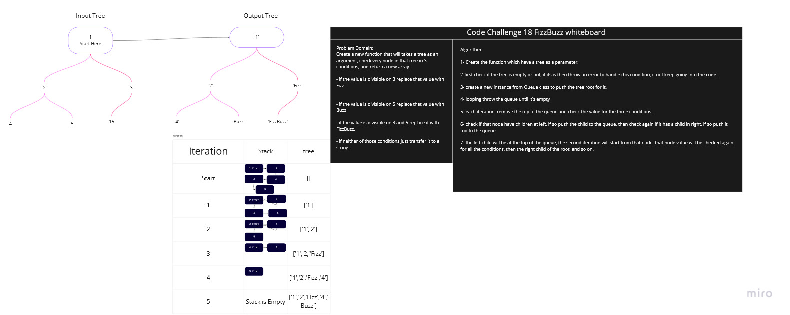

# Binary Tree and BST Implementation

<!-- Short summary or background information -->

## Challenges

<!-- Description of the challenge -->

- ## Code Challenge 18

Create a function that will takes a tree as an argument and will return a new tree in the same order for nodes, under these 3 conditions

- if the value is divisible on 3 replace that value with Fizz

- if the value is divisible on 5 replace that value with Buzz

- if the value is divisible on 3 and 5 replace it with FizzBuzz.

- if neither of those conditions just transfer it to a string

## Approach & Efficiency

<!-- What approach did you take? Why? What is the Big O space/time for this approach? -->

- create a function that will take a tree as an argument.
- check if the tree is empty, if it is then throw an error.
- declare a new tree and push the passed tree node to it.
- push the root to a declared queue that will used to loop throw the entire tree nodes.
- loop until the queue is empty
- check the node value to that 3 conditions and change it's value.
- the node value will change and still in the same position in the tree.
- when the queue is empty the loop will stop and the function will return the new tree, and all nodes values are strings

## Solution

<!-- Embedded whiteboard image -->

- Code Challenge 18 White Board

---
