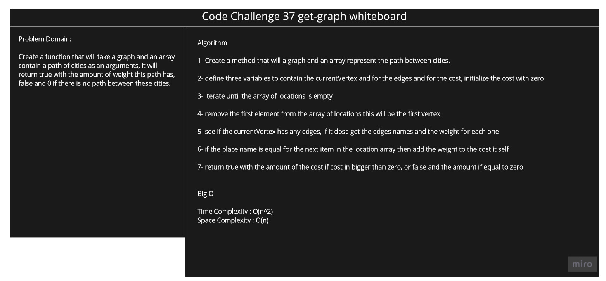

## Challenge

<!-- Description of the challenge -->

Create a function that will take a graph and an array contain a path of cities as an arguments, it will return true with the amount of weight this path has, false and 0 if there is no path between these cities.

## Solution

### Code Challenge 37 WhiteBoard

