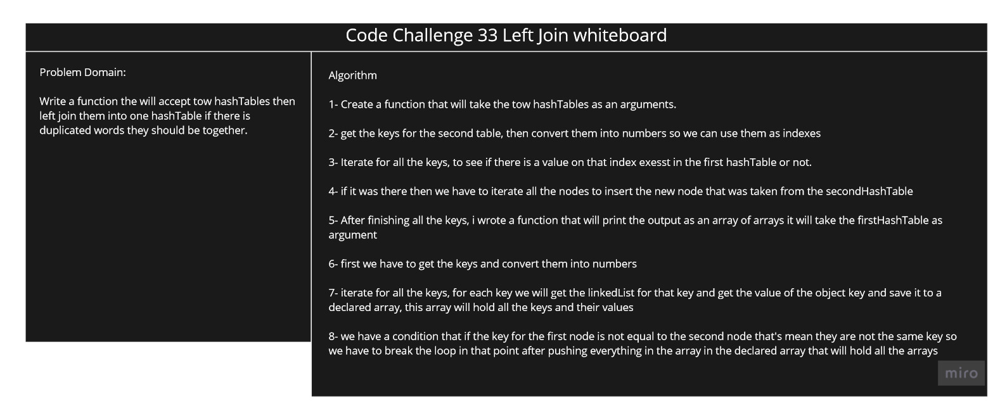

# Challenge Summary

We have tow hashTables, or Lists that we have to join them into ont table, if there is two words that are the same they should appear after each other if there in no duplicated words NULL word should appear.

## Challenge Description

Write a function the will accept tow hashTables then left join them into one hashTable if there is duplicated words they should be together.

## Approach & Efficiency

Time Complicity is O(n)

Space complicity is O(n)

## Solution

