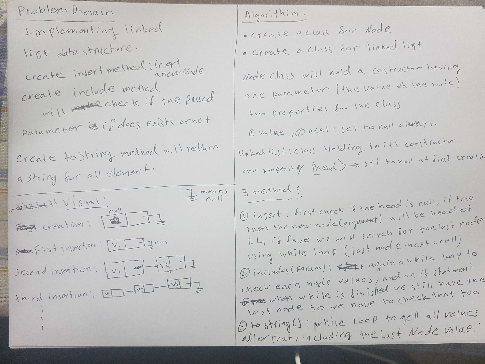

# Reverse an Array

<!-- Short summary or background information -->

## Challenge

<!-- Description of the challenge -->

- Implement a data structure called linkedList.
- Include a method called insert that will insert a new node at the head of the linkedList
- Include a method called includes that return true if the argument is in the linked list, or false it it wasn't
- Include a method called toString that will return a string of all the values in the linkedList
- Include a method called append to add a node to the end of the linked list
- Include a method called InsertAfter to add a node after a specific node
- Include a method called InsertBefore to add a node before a specific node
- Include a method called kthFromEnd to get the value of passed index from the end of linkedList

## Approach & Efficiency

<!-- What approach did you take? Why? What is the Big O space/time for this approach? -->

Make sure that the head is null in the first implementation, if that make the head the first node, if not find the last one and make the new node there,

includes, this will check all nodes values in an if condition

toString, will get all values an concat them into one string

InsertAfter : To insert a new Node, first this node should be reference to the next node,before adding it, and the previous node next should be at the added node

InsertBefore : To insert a new Node, first this node should be reference to the next node,before adding it, and the after node next should be at the added node.

kthFromEnd : create an array of the values for all the Nodes, revers it then find the value for the passed index

- Big O is O(n), since we are moving for for all the elements before inserting a new one

## Solution

<!-- Embedded whiteboard image -->

- Code Challenge 5 White Board

- Code Challenge 6 White Board

- Code Challenge 7 White Board

