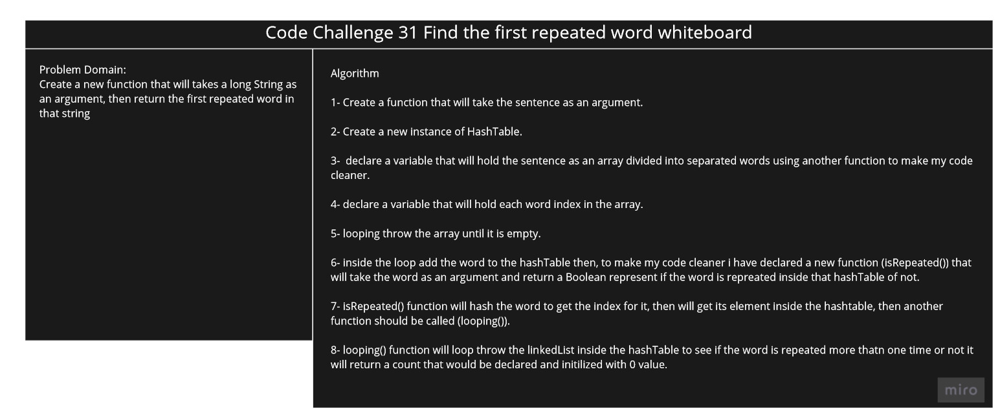

# Challenge Summary

We Have a String (Long Sentence) we need to get the first repeated word on it

## Challenge Description

Write a function that will accept a string as a parameter and it will return the first repeated word.

## Approach & Efficiency

First I have divided the string into an array of words after removing all the spaces, then for each word after adding it to the hashTable i will check if it has a next value of not, it it has i will got throw the linkedList to see if the word is repeated more that 2 times, at that pint i will return it.

## Solution

