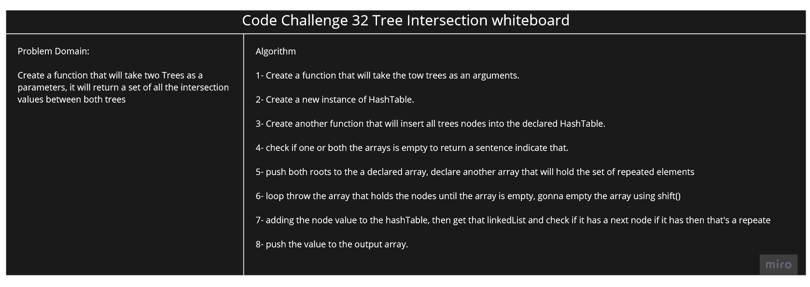

# Challenge Summary

This challenge will use HashMap and BinaryTree Search.

## Challenge Description

Create a function that will take two Trees as a parameters, it will return a set of all the intersection values between both trees

## Approach & Efficiency

First i got an idea to use HahMap, since all the elements in the trees are numbers, i thought it will be a good idea to use these values as indexes in the hashTable.

Since i have to loop throw the two trees to insert all of the nodes values in the linkedList the Time Complexity will Be `O(n)`.

## Solution

