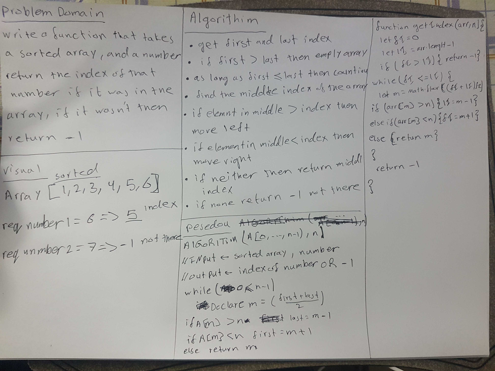

# Reverse an Array

<!-- Short summary or background information -->

## Challenge

<!-- Description of the challenge -->

Write a function that takes 2 parameters a sorted array and a number, it should return the index of that number, of -1 if that number was not in the array

## Approach & Efficiency

<!-- What approach did you take? Why? What is the Big O space/time for this approach? -->

I was Reading on [this](https://en.wikipedia.org/wiki/Binary_search_algorithm) about Pinery search.
The idea is to minimize the iteration to find the index, by begin from the center of the array, and we have two keys to search with.

The first element index (fI)
The last element index. (lI)

then check if (fI) less than or equal to (lI), if it is not then return -1 since the number is not
in the array.
else
first we have to find the center index of the array. (fI+lI)/2.
then check the element of the center index.
if it was larger from the require number then we have to move to the left.
if it was less from the require number then we have to move to the right.
if it was neither then return the index it self.

## Solution

<!-- Embedded whiteboard image -->

