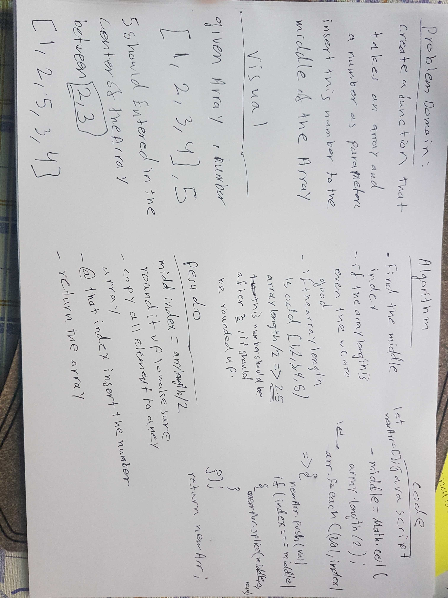

# Reverse an Array

<!-- Short summary or background information -->

## Challenge

<!-- Description of the challenge -->

Write a function that will take and array and a value to be added to the array,return an array with the new value added at the middle index.

## Approach & Efficiency

<!-- What approach did you take? Why? What is the Big O space/time for this approach? -->

First it was necessary to find the middle index and round it up using Math.ceil(), so we can add the number to that location, then we have two options, we can change tha same array, or create a new array with the new elements

## Solution

<!-- Embedded whiteboard image -->

