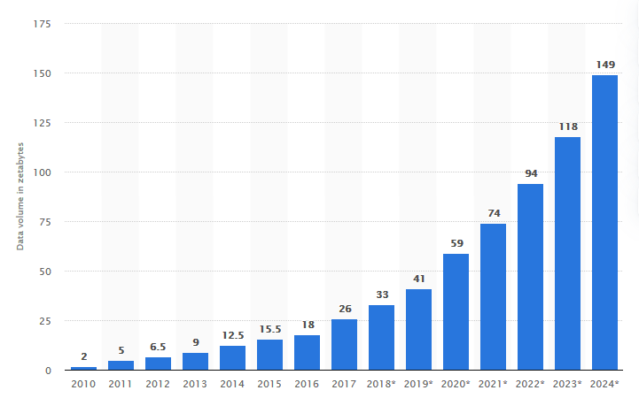
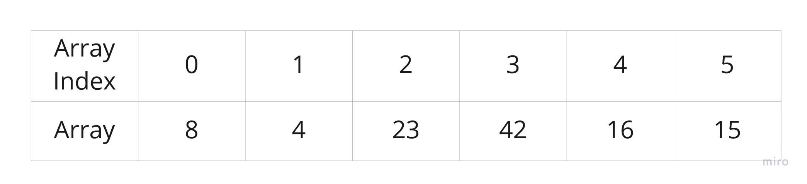
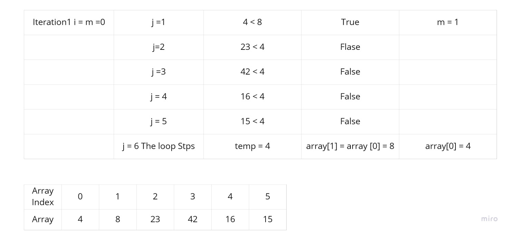
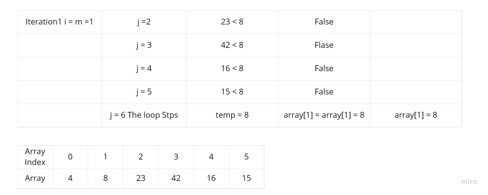
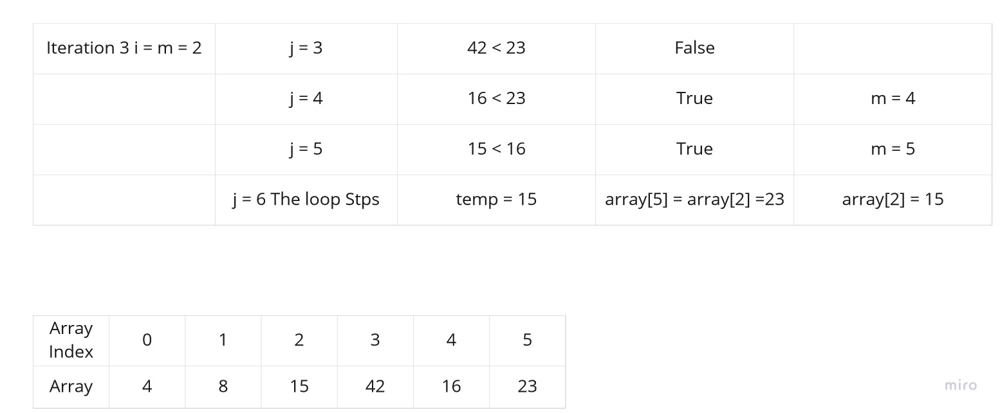
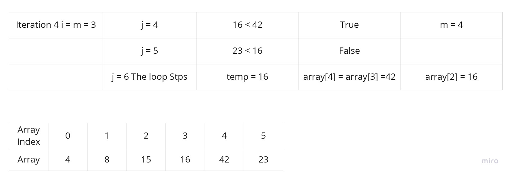
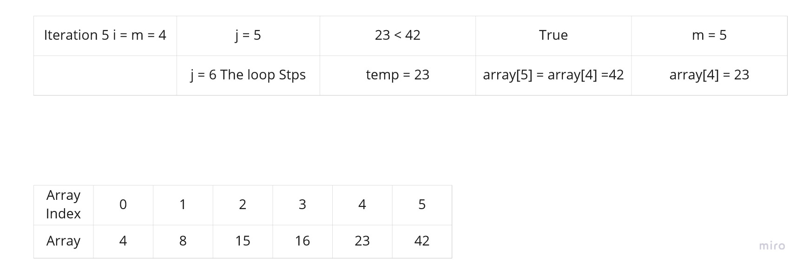

# Sort Algorithms

In this blog I will take about sort algorithms.



The World data are growing at an enormous rate, as you can see in the picture above in 2024 the data size excepted to be 149 Zettabytes. [Statista ](https://www.statista.com/statistics/871513/worldwide-data-created/).

1 ZB = 10007bytes = 1021bytes = 1000000000000000000000 bytes, ZB is a 1 with 21 Zeros beside it.

This growth is increasing year after year, because of that sorting algorithms comes in hand so we can search faster and more efficient in a huge size of data.

There is several types of these sorting, each type has a different complexity (Big O), we will start talking about them one by one.

## 1. Selection Sort

Selection Sort is a sorting algorithm that traverses the array multiple times as it slowly builds out the sorting sequence. The traversal keeps track of the minimum value and places it in the front of the array which should be incrementally sorted.

### Implementation

```javascript
const insertionSort = (array) => {
  const n = array.length;
  for (let i = 0; i < n - 1; i++) {
    let min = i;
    for (let j = i + 1; j < n; j++) {
      if (array[j] < array[min]) {
        min = j;
      }
    }
    let temp = array[min];
    array[min] = array[i];
    array[i] = temp;
  }
  return array;
};
```

### Tracing

We will take this array as an example so get fully understand of this algorithm.



### First Iteration



### Second Iteration



### Third Iteration



### Fourth Iteration



### Fifth Iteration


